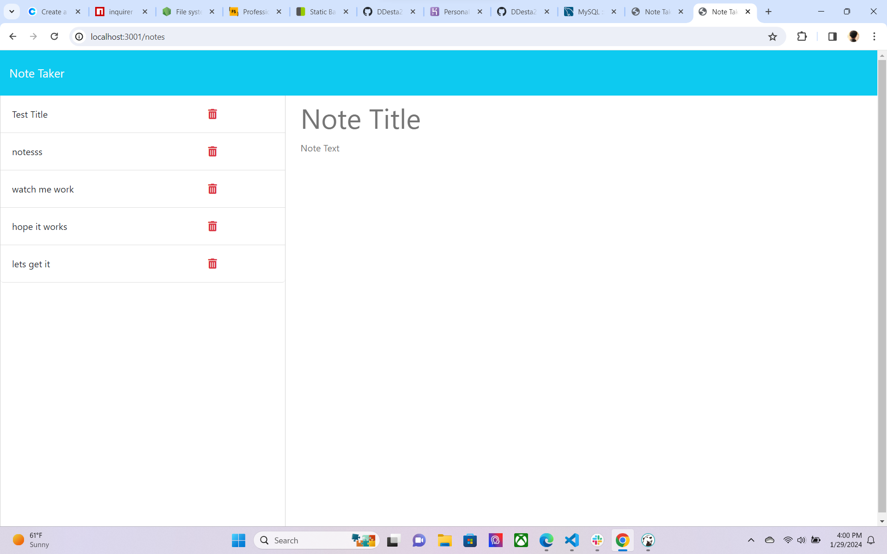

# Note-Taker

## Description
  It takes notes you write on the page and saves them on the side

## Badges

## Visuals

## Installation
npm i helped me install all my files I needed
 
 ## Table of Contents 
  
  
  
  - [Installation](#installation)
  - [Usage](#usage)
  - [Credits](#credits)
  - [License](#license)

## Usage
  
 use this app to take notes and have them append to the page every time you save your generated notes
  

## Support
If your having any issues feel free to reach out to me on my email and I will answer to the best of my knowledge
tekoladaniel@gmail.com

## Roadmap
If you have ideas for releases in the future, it is a good idea to list them in the README.

## Contributing
Instructor and TA helped fix up the code

## Authors and acknowledgment
Show your appreciation to those who have contributed to the project.
Help from instructor and the TA

## License
 
A short and simple permissive license with conditions only requiring preservation of copyright and license notices. Licensed works, modifications, and larger works may be distributed under different terms and without source code.
  [https://choosealicense.com/licenses/mit/](https://choosealicense.com/licenses/mit/)

## Project status
Project is running and taking notes and saving them

  
  ## Tests
  node server.js to run the test 

